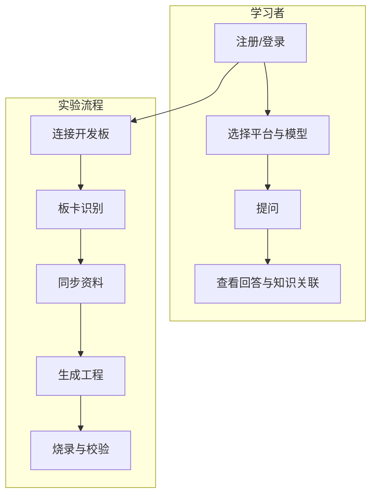

# 嵌入式系统学习助手 — 课程项目报告

---

**项目名称：** 嵌入式系统学习 AGENT（Embedded System Learning Agent）  
**项目类型：** 课程综合设计 / 软件工程实践项目  
**完成日期：** 2026 年 6 月  

**项目组成员：**

| 学号 | 姓名 | 备注 |
|------|------|------|
| 2350944 | 赵诣 | 组长 |
| 2351273 | 邓语乐 | 组员 |
| 2351875 | 李璐巍 | 组员 |
| 2356218 | 孙凯文 | 组员 |
| 2354275 | 邱婉莹 | 组员 |

---

## 摘要

本项目面向嵌入式系统学习场景，设计并实现了一套集 **智能问答** 与 **板卡开发辅助** 于一体的学习助手系统。系统采用 **检索增强生成（RAG）** 架构：以本地 JSON 结构化知识库为底座，结合字符级 n-gram TF-IDF 语义检索与大语言模型（通义千问 / DeepSeek）生成能力，为用户提供 STM32、ESP32、华为开发板、飞腾开发板等多平台方向的嵌入式概念答疑与学习路径引导。

在问答能力之外，项目进一步扩展了 **板卡助手** 子系统：基于 FastAPI 构建 RESTful 后端，实现 USB/串口设备探针扫描、板卡型号融合识别、官方资料同步缓存、工程模板生成、烧录计划与串口运行校验、原型评估报告等完整链路，并通过 Streamlit 前端与静态 HTML 原型页面提供统一交互入口。

系统具备登录注册、多会话管理、意图识别、术语高亮、知识关联可视化（Mermaid 子图）、API Key 缺失时知识库摘要降级等特性；后端配套 SQLite 持久化、Bearer Token 鉴权、统一错误码与自动化 API 测试（20+ 用例）。本项目验证了「轻量本地检索 + 云端大模型 + 硬件辅助工作流」在嵌入式教学场景中的可行性与实用价值。

**关键词：** 嵌入式系统；RAG；TF-IDF；大语言模型；Streamlit；FastAPI；板卡识别；学习助手

---

## 目录

1. [引言](#1-引言)
2. [需求分析](#2-需求分析)
3. [系统总体设计](#3-系统总体设计)
4. [关键技术方案](#4-关键技术方案)
5. [功能模块详细设计](#5-功能模块详细设计)
6. [数据库与接口设计](#6-数据库与接口设计)
7. [前端与用户交互设计](#7-前端与用户交互设计)
8. [测试与质量保障](#8-测试与质量保障)
9. [部署与运行说明](#9-部署与运行说明)
10. [项目成果与演示说明](#10-项目成果与演示说明)
11. [总结与展望](#11-总结与展望)
12. [参考文献与资料来源](#12-参考文献与资料来源)
13. [附录](#13-附录)

---

## 1. 引言

### 1.1 项目背景

嵌入式系统涵盖微控制器选型、外设驱动、RTOS、通信协议、工具链配置、调试排错等众多知识点，学习曲线陡峭。传统学习方式依赖教材、厂商手册与碎片化网络资料，存在以下痛点：

- **检索效率低**：同一概念在不同平台（如 STM32 HAL 与 ESP-IDF）表述差异大，初学者难以快速定位答案；
- **上下文割裂**：问答类工具缺乏与本地课程/实验知识库的结构化关联；
- **理论与实践脱节**：识别开发板型号、生成工程、烧录校验等实验环节步骤繁琐，缺少一体化辅助工具；
- **大模型幻觉风险**：通用 LLM 可能编造寄存器位、引脚号等细节，不适合直接用于嵌入式严谨场景。

因此，本项目提出 **「本地可信知识库 + RAG 检索 + 可选云端大模型 + 板卡实验工作流」** 的综合方案，在保障回答可追溯性的同时，扩展硬件实验辅助能力。

### 1.2 项目目标

| 目标编号 | 描述 | 达成情况 |
|----------|------|----------|
| G1 | 构建覆盖多平台的嵌入式本地知识库，支持高效检索 | 已实现（52 条结构化条目 + 433 条术语） |
| G2 | 实现基于 RAG 的智能问答，支持通义千问与 DeepSeek | 已实现 |
| G3 | 提供用户登录、多会话、管理员与普通用户区分 | 已实现 |
| G4 | 实现板卡识别 → 资料同步 → 工程生成 → 烧录校验四段式工作流 | 已实现 |
| G5 | 后端 API 规范化、可测试、可扩展 | 已实现（FastAPI + SQLite + 自动化测试） |
| G6 | 提供静态 UI 原型与 Streamlit 可运行界面 | 已实现 |

### 1.3 项目范围

**包含：**

- Streamlit 主应用（学习问答 + 板卡助手）
- FastAPI 板卡助手后端及 SQLite 数据层
- 本地知识库、术语表与 RAG 流水线
- 静态 HTML/CSS 界面原型
- 自动化测试与 Postman API 集合
- 多 Agent 协作文档规范（`AGENTS.md` + `prompts/agents/`）

**不包含：**

- Neo4j 等 heavyweight 图数据库（采用 JSON + 轻量子图方案）
- 真实硬件烧录工具链的全量集成（当前以模拟命令 + 串口校验脚本为主，便于课程演示与 CI 测试）
- 生产级用户鉴权（当前为本地 JSON 存储 + 开发 Token）

---

## 2. 需求分析

### 2.1 用户角色

| 角色 | 典型诉求 |
|------|----------|
| **普通学习者** | 提问嵌入式概念、对比方案、获取学习路径；管理个人对话历史 |
| **实验课学生** | 连接开发板，识别型号，生成 LED 等入门工程，完成烧录与串口输出校验 |
| **管理员** | 使用系统全部功能；查看术语命中、意图识别等调试信息（与普通用户界面能力基本一致，预留扩展空间） |
| **开发者/评审者** | 通过 API 与测试用例验证后端行为 |

### 2.2 功能性需求

#### 2.2.1 学习问答模块

| 编号 | 需求描述 | 优先级 |
|------|----------|--------|
| FQ-01 | 用户注册、登录、退出 | 高 |
| FQ-02 | 选择平台侧重（全部/STM32/ESP32/华为/飞腾） | 高 |
| FQ-03 | 选择 LLM 提供方（通义千问/DeepSeek）及模型名 | 高 |
| FQ-04 | 基于知识库 Top-K 检索并拼装 Prompt | 高 |
| FQ-05 | 流式输出大模型回答 | 高 |
| FQ-06 | API Key 未配置或调用失败时降级为知识库摘要 | 高 |
| FQ-07 | 意图识别（规则兜底 + LLM 可选） | 中 |
| FQ-08 | 术语表 Aho-Corasick 匹配展示 | 中 |
| FQ-09 | 知识点关联 Mermaid 子图 | 中 |
| FQ-10 | 多会话新建、切换、重命名、删除 | 高 |

#### 2.2.2 板卡助手模块

| 编号 | 需求描述 | 优先级 |
|------|----------|--------|
| FB-01 | USB/串口设备扫描与探针快照 | 高 |
| FB-02 | 多信号融合板卡识别（VID/PID、关键词、用户输入） | 高 |
| FB-03 | 低置信度时提示人工确认 / 二次识别 | 高 |
| FB-04 | 同步板卡官方资料并缓存 | 中 |
| FB-05 | 按板卡型号与需求生成工程模板 | 高 |
| FB-06 | 烧录计划生成、用户确认门禁、任务执行 | 高 |
| FB-07 | 串口运行校验（关键字匹配/超时/端口异常） | 高 |
| FB-08 | 原型评估任务与报告生成 | 中 |

### 2.3 非功能性需求

| 类别 | 要求 |
|------|------|
| **可用性** | 侧栏导航清晰；学习问答可独立运行，不强制依赖后端 |
| **可维护性** | 前后端分层；服务/仓储/基础设施分离；统一错误码 |
| **可测试性** | 后端 API 单元/集成测试；探针与串口可 Mock |
| **安全性** | API Bearer Token；烧录前用户确认；禁止命令策略表 |
| **可扩展性** | 知识库 JSON 可增删；板卡特征库可扩展；模板注册表可插拔 |
| **性能** | 本地 TF-IDF 检索毫秒级；LLM 调用异步流式展示 |

### 2.4 用例概览



---

## 3. 系统总体设计

### 3.1 系统架构

系统采用 **前后端分离 + 本地 RAG 引擎** 的混合架构：

```
┌─────────────────────────────────────────────────────────────────┐
│                        用户浏览器                                │
└───────────────────────────┬─────────────────────────────────────┘
                            │
         ┌──────────────────┴──────────────────┐
         │                                     │
         ▼                                     ▼
┌─────────────────────┐              ┌─────────────────────┐
│  Streamlit 前端      │   HTTP/JSON  │  FastAPI 后端        │
│  login.py / webui.py │◄────────────►│  backend/main.py     │
│  board_assistant_page│              │  /api/v1/*           │
└─────────┬───────────┘              └──────────┬──────────┘
          │                                      │
          │ 本地调用                              │ SQLite
          ▼                                      ▼
┌─────────────────────┐              ┌─────────────────────┐
│  RAG 核心层          │              │  board_assistant.db  │
│  embedded_kb.py      │              │  + workspaces/       │
│  embedded_glossary.py│              └─────────────────────┘
│  llm_client.py       │
└─────────┬───────────┘
          │
          ▼
┌─────────────────────┐       ┌─────────────────────┐
│  data/embedded/      │       │  云端 LLM API        │
│  embedded_kb.json    │       │  DashScope / DeepSeek│
│  glossary.txt        │       └─────────────────────┘
└─────────────────────┘
```

**设计要点：**

1. **学习问答路径**完全可在 Streamlit 进程内闭环，降低部署门槛；
2. **板卡助手路径**通过 `frontend/api_client.py` 调用 FastAPI，职责边界清晰；
3. **静态 UI**（`static-ui/`）作为视觉与交互原型，便于评审与改稿，与 Streamlit 正式应用并行存在。

### 3.2 技术栈选型

| 层次 | 技术 | 选型理由 |
|------|------|----------|
| 前端框架 | Streamlit 1.28+ | Python 技术栈统一，适合课程项目快速迭代 |
| 后端框架 | FastAPI 0.115+ | 高性能、自动 OpenAPI 文档、类型友好 |
| 检索引擎 | scikit-learn TF-IDF | 无 GPU 依赖，适合中小规模本地知识库 |
| 术语匹配 | pyahocorasick | 多模式串匹配，适合数百术语实时命中 |
| 大模型接入 | httpx + OpenAI 兼容 API | 通义/DeepSeek 均支持兼容模式，便于切换 |
| 持久化 | SQLite | 零配置、单文件、满足课程演示与测试 |
| 硬件探针 | pyserial + pyusb | 扫描串口与 USB 设备信息 |
| 测试 | pytest + FastAPI TestClient | 与后端同语言，Mock 友好 |

### 3.3 目录结构说明

```
EmbeddedSystemLearning-Agent/
├── login.py                 # Streamlit 登录/注册入口
├── webui.py                 # 主界面：学习问答 + 导航
├── llm_client.py            # 大模型调用、意图识别、KB 兜底
├── embedded_kb.py           # 知识库加载与 TF-IDF 检索
├── embedded_glossary.py     # 术语 Aho-Corasick 匹配
├── user_data_storage.py     # 用户凭证 JSON 存储
├── ui_style.py              # 全局 CSS 注入
├── backend/                 # FastAPI 后端
│   ├── main.py              # 应用入口
│   ├── api/routes/          # REST 路由
│   ├── services/            # 业务服务层
│   ├── repositories/        # SQLite 仓储
│   ├── infrastructure/      # 设备扫描、官方源客户端
│   ├── models/schemas.py    # Pydantic 模型
│   └── tests/               # API 自动化测试
├── frontend/                # Streamlit 子模块
│   ├── api_client.py        # 后端 HTTP 客户端
│   └── board_assistant_page.py
├── data/
│   ├── embedded/            # 知识库 JSON + 术语表
│   └── references/          # 参考 PDF 资料
├── static-ui/               # 静态 HTML/CSS 原型
├── scripts/                 # 启动、串口检测等脚本
├── config/                  # secrets 配置模板
├── prompts/                 # Agent 提示词与 Postman 集合
└── docs/                    # 项目文档（含本报告）
```

### 3.4 多 Agent 协作开发规范

项目采用 **5 Agent 固定协作模式**（详见仓库 `AGENTS.md`），保证从需求到评审链路可追踪：

| Agent | 职责 | 产出位置 |
|-------|------|----------|
| Agent 1 | 需求与接口设计 | `devdocs/` |
| Agent 2 | 改动规划 | `.ai-workspace/` |
| Agent 3 | 代码实现 | 业务代码目录 |
| Agent 4 | 测试与 QA | 测试目录 |
| Agent 5 | 架构评审 | 评审结论 |

该规范体现了本项目在 **软件工程方法论** 上的完整性，便于课程答辩时说明团队协作与质量控制流程。

---

## 4. 关键技术方案

### 4.1 本地知识库与 TF-IDF 检索

知识库文件 `data/embedded/embedded_kb.json` 采用 **数组型 JSON 文档**，单条结构包含：

| 字段 | 说明 |
|------|------|
| `id` | 唯一标识，如 `kb-001` |
| `title` | 条目标题 |
| `tags` | 标签列表 |
| `platform` | 适用平台（STM32/ESP32/华为开发板/飞腾开发板/通用） |
| `body` | 正文内容 |
| `source` | 来源说明 |
| `related_ids` | 关联知识点 ID |
| `prerequisite_ids` | 前置知识点 ID |

**检索流程（`EmbeddedKB.search`）：**

1. 将 title、tags、platform、body 拼接为文档语料；
2. 使用 `TfidfVectorizer(analyzer="char_wb", ngram_range=(1,2), max_features=8000)` 构建稀疏矩阵；
3. 对用户 query 计算余弦相似度；
4. 若指定平台，对匹配平台或「通用」条目施加 1.25 倍 boost；
5. 返回 Top-K（默认 5）条目及得分。

**选型说明：** 字符 n-gram 对中文嵌入式术语（如「NVIC」「ESP-IDF」）鲁棒性较好，且无需额外分词依赖；当前 52 条规模下延迟可忽略。

### 4.2 知识关联子图（轻量 Graph）

不使用 Neo4j，而通过 JSON 内 `related_ids` / `prerequisite_ids` 构建局部子图：

- `subgraph_for_docs()` 从命中条目向外扩展关联/前置节点（上限 12 节点）；
- `mermaid_from_subgraph()` 生成 Mermaid `graph LR` 语法；
- 前端以 expander 形式展示，辅助学习者理解知识脉络。

### 4.3 RAG Prompt 拼装策略

`_build_answer_messages()` 构造两类消息：

- **System**：强调必须依据参考资料、禁止编造寄存器/引脚、资料不足时需声明；
- **User**：包含「用户意图（参考）」「参考资料 Top-K 块」「用户问题」。

该策略有效抑制大模型幻觉，使回答 **可追溯到具体 KB 条目与 source 字段**。

### 4.4 大模型接入与降级

`llm_client.py` 支持：

- **通义千问**：DashScope OpenAI 兼容端点；
- **DeepSeek**：官方 OpenAI 兼容端点；
- **流式输出**：SSE 解析 `delta.content`；
- **意图识别**：优先 LLM 分类至 8 类意图，失败则 `fallback_intent()` 规则匹配；
- **降级路径**：无 Key 或 HTTP 异常时调用 `answer_from_kb_only()` 返回检索摘要。

### 4.5 术语表匹配

`GlossaryMatcher` 使用 **Aho-Corasick 自动机** 对 `glossary.txt`（433 行术语）进行多模式匹配，在用户问题中实时高亮命中术语，辅助意图理解与调试展示。

### 4.6 板卡融合识别算法

`board_matcher.py` 维护 `BOARD_FEATURES` 特征库，每条包含：

- 厂商、型号、别名；
- 典型 USB VID/PID；
- 串口描述关键词；
- USB 产品字符串关键词。

`score_candidates()` 对用户输入、串口详情、USB 设备列表 **加权融合打分**，输出 `CandidateScore` 列表。识别服务 `board_detection_service.py` 在得分低于阈值或 Top1/Top2 差距过小时设置 `needConfirm=True`，要求用户二次确认或手动指定候选，降低误识别风险。

### 4.7 安全与烧录门禁

`safety_service.py` 与 `safety_policies` 表定义：

- 烧录前是否强制用户确认；
- 允许的编程器列表；
- 禁止执行的命令模式；
- 最大重试次数。

API 层在 `/projects/{id}/flash` 执行前校验 `userConfirmed` 等字段，防止误操作。

---

## 5. 功能模块详细设计

### 5.1 用户认证模块

- **入口：** `login.py`
- **存储：** `tmp_data/user_credentials.json`
- **默认管理员：** 用户名 `admin`，密码 `admin123`（首次初始化）
- **能力：** 登录、注册、退出；区分 `is_admin` 标志；登录成功后进入 `webui.main()`

### 5.2 学习问答模块

- **入口：** `webui.py` → 侧栏选择「学习问答」
- **核心流程：**

```
用户输入问题
    → TF-IDF 检索 Top-5
    → 意图识别（LLM / 规则）
    → 术语表匹配
    → 构建 Prompt
    → 流式 LLM 回答（或 KB 摘要）
    → 可选展示：术语 / 意图 / Prompt / Mermaid 子图
    → 写入当前会话 messages
```

- **会话管理：** 支持多窗口 `chat_windows`、标题自动/手动命名、删除与清空全部历史

### 5.3 板卡助手模块

- **入口：** `webui.py` → 侧栏选择「板卡助手」→ `render_board_assistant_page()`
- **四段式流程：**

| 步骤 | 功能 | 对应 API |
|------|------|----------|
| ① 识别板卡 | USB/串口扫描 + 融合匹配 | `POST /api/v1/boards/detect`、`/identify` |
| ② 同步资料 | 拉取/缓存官方资料 | `POST /api/v1/boards/knowledge/sync` |
| ③ 生成工程 | 模板渲染 + workspace | `POST /api/v1/projects/generate` |
| ④ 烧录校验 | 烧录计划/执行 + 串口校验 | `POST .../flash/plan`、`.../flash`、`.../run-check` |

- **任务查询：** `GET /api/v1/tasks/{task_id}` 获取烧录/校验任务日志与产物信息
- **评估：** `POST /api/v1/evaluations/prototype/run` 与 `.../reports/generate`

### 5.4 后端服务层一览

| 服务模块 | 文件 | 职责 |
|----------|------|------|
| 板卡识别 | `board_detection_service.py` | detect / identify |
| 板卡匹配 | `board_matcher.py` | 多信号打分 |
| 资料同步 | `knowledge_sync_service.py` | 官方源抓取与缓存 |
| 工程生成 | `project_generation_service.py` | 模板解析与文件渲染 |
| 模板注册 | `template_registry.py` | 板卡族/框架/工具链模板 |
| 烧录 | `flash_service.py` | 计划生成与任务执行 |
| 运行校验 | `run_check_service.py` | 串口读关键字断言 |
| 评估 | `evaluation_service.py` | 原型评估与报告 |
| 任务 | `task_service.py` | 异步任务状态管理 |
| 安全 | `safety_service.py` | 烧录策略校验 |

### 5.5 静态 UI 原型

`static-ui/` 提供纯 HTML/CSS 页面：

- `auth.html` — 登录/注册
- `chat-user.html` / `chat-admin.html` — 对话界面示意
- `index.html` — 总览导航

用于 **视觉评审与交互稿讨论**，与 Streamlit 正式应用互补。

---

## 6. 数据库与接口设计

### 6.1 SQLite 数据模型

数据库文件默认路径：`data/board_assistant.db`（可通过环境变量 `BOARD_ASSISTANT_DB_PATH` 配置）。

主要数据表：

| 表名 | 用途 |
|------|------|
| `board_profiles` | 板卡档案（厂商、MCU、Flash/RAM、引脚映射等） |
| `source_refs` | 官方资料引用与校验信息 |
| `projects` | 生成的工程元数据 |
| `project_tasks` | 烧录/校验等任务记录 |
| `safety_policies` | 板卡级安全策略 |
| `evaluation_tasks` / `evaluation_reports` | 评估任务与报告 |
| `device_probe_snapshots` | 设备探针快照 |
| `board_match_traces` | 识别打分追踪 |
| `serial_run_check_reports` | 串口校验报告 |
| `knowledge_cache_entries` | 资料同步缓存 |
| `project_template_registry` | 工程模板注册 |
| `flash_plans` | 烧录计划 |

完整 DDL 见 `backend/repositories/schema.sql`。

### 6.2 REST API 一览

**鉴权：** 所有 `/api/v1/*` 接口需 Header `Authorization: Bearer <token>`，默认开发 Token 为 `dev-token`。

| 方法 | 路径 | 说明 |
|------|------|------|
| POST | `/api/v1/boards/detect` | 板卡识别 |
| POST | `/api/v1/boards/identify` | 二次识别 |
| POST | `/api/v1/boards/knowledge/sync` | 同步官方资料 |
| POST | `/api/v1/projects/generate` | 生成工程 |
| POST | `/api/v1/projects/{id}/flash/plan` | 生成烧录计划 |
| POST | `/api/v1/projects/{id}/flash` | 执行烧录任务 |
| POST | `/api/v1/projects/{id}/run-check` | 串口运行校验 |
| GET | `/api/v1/tasks/{task_id}` | 查询任务详情 |
| POST | `/api/v1/evaluations/prototype/run` | 启动原型评估 |
| POST | `/api/v1/evaluations/reports/generate` | 生成评估报告 |

**错误响应格式：**

```json
{
  "errorCode": "BOARD_DETECT_EMPTY",
  "message": "未扫描到可识别设备"
}
```

Postman 集合：`prompts/sirius-api.postman.json`。

### 6.3 配置项

| 环境变量 | 默认值 | 说明 |
|----------|--------|------|
| `DASHSCOPE_API_KEY` | — | 通义千问 API Key |
| `DEEPSEEK_API_KEY` | — | DeepSeek API Key |
| `BOARD_ASSISTANT_API_TOKEN` | `dev-token` | 后端鉴权 Token |
| `BOARD_ASSISTANT_API_BASE_URL` | `http://127.0.0.1:8000` | 前端调用后端地址 |
| `BOARD_ASSISTANT_DB_PATH` | `data/board_assistant.db` | SQLite 路径 |
| `BOARD_ASSISTANT_WORKSPACE` | `data/workspaces` | 工程工作区 |
| `BOARD_DETECT_CONFIDENCE` | `0.8` | 识别置信度阈值 |

密钥模板：`config/secrets.example.env` → 复制为 `config/secrets.env`。

---

## 7. 前端与用户交互设计

### 7.1 设计原则

- **简洁浅色主题**：`.streamlit/config.toml` 配置淡蓝 + 淡绿主基调；
- **侧栏集中配置**：平台、模型、页面导航、会话列表；
- **对话区类 ChatGPT 体验**：`st.chat_message` + 流式 `write_stream`；
- **板卡助手步骤条**：四段进度可视化（已完成 / 进行中 / 待办）；
- **错误友好化**：中文主提示 + 可折叠技术详情。

### 7.2 学习问答交互要点

- 侧栏可选平台侧重，影响检索 boost；
- 模型支持下拉 + 自定义输入；
- 示例问题一键填入；
- 管理员与普通用户均可使用；调试 expander 可查看检索中间结果。

### 7.3 板卡助手交互要点

- 步骤 1 支持勾选 USB/串口扫描、手动输入型号；
- 低置信度时展示候选列表与确认按钮；
- 各步骤结果以 KV 卡片 + JSON expander 双重展示；
- 烧录前显式确认，符合安全策略。

---

## 8. 测试与质量保障

### 8.1 后端自动化测试

测试文件：`backend/tests/test_backend_api.py`

覆盖场景（共 20+ 用例）包括：

| 类别 | 代表用例 |
|------|----------|
| 鉴权 | 缺少 Authorization 返回 401 |
| 板卡识别 | 正常返回候选；低置信度 needConfirm；无设备 404 |
| 二次识别 | 手动候选解析；未知 requestId 404 |
| 资料同步 | 未知板卡 404；缓存命中 |
| 工程生成 | 空需求 422；正常返回 projectId |
| 烧录 | 未确认拒绝；成功路径；计划缺失产物错误 |
| 串口校验 | 关键字缺失；成功；超时；端口打开失败 |
| 任务查询 | 未知 taskId 404 |
| 评估 | 空场景名拒绝；报告生成；任务不存在 404 |

**运行方式：**

```bash
cd EmbeddedSystemLearning-Agent
pytest backend/tests/ -v
```

测试采用 `monkeypatch` 模拟设备探针与串口行为，保证 CI 环境无真实硬件仍可回归。

### 8.2 前端与集成测试

- Streamlit 界面以 **手工测试用例** 为主（登录、问答、会话、板卡流程）；
- 静态 UI 通过浏览器直接打开 HTML 验证布局；
- API 与 Streamlit 联调：先启后端再启前端，验证板卡助手全链路。

### 8.3 质量结论

- 后端核心 API 行为有自动化回归保障；
- RAG 问答路径在无 API Key 时仍可演示（KB 摘要模式）；
- 错误码与 HTTP 状态码映射统一，便于前端处理与用户理解。

---

## 9. 部署与运行说明

### 9.1 环境要求

- Python 3.10 / 3.11（推荐 3.10+）
- Windows / Linux / macOS
- 可选：连接 STM32 Blue Pill / ESP32 DevKit 等开发板（板卡助手完整体验）

### 9.2 依赖安装

```bash
# 创建虚拟环境（示例）
python -m venv .venv
# Windows
.\.venv\Scripts\activate
# Linux/macOS
source .venv/bin/activate

pip install -r requirements.txt
```

主要依赖：`streamlit`、`fastapi`、`uvicorn`、`httpx`、`scikit-learn`、`numpy`、`pyahocorasick`、`pyserial`、`pyusb`。

### 9.3 配置密钥

```bash
copy config\secrets.example.env config\secrets.env
# 编辑 config\secrets.env，填写 DASHSCOPE_API_KEY 和/或 DEEPSEEK_API_KEY
```

### 9.4 启动方式

#### 方式 A：仅使用学习问答（推荐快速体验）

```bash
python -m streamlit run login.py --server.port 8502
```

浏览器访问：`http://localhost:8502`

#### 方式 B：完整功能（学习问答 + 板卡助手）

**终端 1 — 启动后端：**

```bash
python -m uvicorn backend.main:app --host 0.0.0.0 --port 8000 --app-dir .
```

> 说明：若直接运行 `python scripts/start_backend.py` 可能出现 `No module named 'backend'`，需加上 `--app-dir .` 或设置 `PYTHONPATH` 为项目根目录。

**终端 2 — 启动前端：**

```bash
python -m streamlit run login.py --server.port 8502
```

#### 方式 C：Linux/macOS 一键脚本

```bash
bash scripts/start_project.sh
# 停止：bash scripts/stop_project.sh
```

### 9.5 默认账号

| 用户名 | 密码 | 角色 |
|--------|------|------|
| admin | admin123 | 管理员 |

新用户可通过注册页自行创建普通账号。

---

## 10. 项目成果与演示说明

### 10.1 量化成果

| 指标 | 数值 |
|------|------|
| 知识库条目 | 52 条 |
| 术语表规模 | 433 词 |
| 支持平台标签 | STM32、ESP32、华为开发板、飞腾开发板、通用 |
| 后端 API 端点 | 10 个 |
| SQLite 数据表 | 13 张 |
| 自动化测试用例 | 20+ |
| 预置板卡特征 | STM32F103 Blue Pill、ESP32-DevKitC 等 |

### 10.2 建议演示流程（答辩用）

**Part 1 — 学习问答（约 5 分钟）**

1. 登录系统，选择平台「STM32」、模型「通义千问 qwen-turbo」；
2. 提问：「STM32 里 NVIC 中断优先级如何分组？」；
3. 展示流式回答、展开「知识点关联」Mermaid 图；
4. 可选：关闭 API Key 演示 KB 摘要降级。

**Part 2 — 板卡助手（约 5 分钟，需后端）**

1. 切换侧栏至「板卡助手」；
2. 输入型号或连接开发板，执行识别；
3. 同步资料 → 生成 LED 心跳工程；
4. 展示烧录计划、确认烧录、串口校验结果；
5. 可选：生成原型评估报告。

**Part 3 — 工程规范（约 2 分钟）**

1. 展示项目目录分层、API 测试通过截图；
2. 说明多 Agent 协作流程与 Postman 集合。

### 10.3 项目亮点

1. **双模式运行**：问答可独立部署，降低使用门槛；
2. **轻量 RAG**：无向量数据库依赖，适合教学场景复现；
3. **端到端板卡工作流**：从识别到校验闭环；
4. **可测试后端**：Mock 硬件探针，适合无实验室环境的评审；
5. **工程化文档**：Agent 规范、API 集合、静态 UI 原型齐全。

---

## 11. 总结与展望

### 11.1 项目总结

本项目成功实现了一套面向嵌入式系统学习的智能助手，融合了 **本地知识检索、大模型增强生成、硬件实验辅助** 三类能力。通过 RAG 约束与 source 追溯，在保持回答灵活性的同时降低了幻觉风险；板卡助手子系统将实验课中繁琐的多工具操作收敛为统一 Web 流程，具有明确的教学推广价值。

团队在架构分层、API 规范、自动化测试与协作文档方面进行了系统化建设，达到了课程项目对 **功能完整性、工程质量与文档规范** 的综合要求。

### 11.2 不足与改进方向

| 方向 | 现状 | 改进计划 |
|------|------|----------|
| 知识库规模 | 52 条演示级 | 扩展至章节级/手册级，引入增量更新工具 |
| 向量检索 | TF-IDF | 可选接入 embedding + 向量库提升语义召回 |
| 烧录集成 | 模拟命令为主 | 对接 OpenOCD、esptool、STM32CubeProgrammer |
| 用户系统 | 本地 JSON | 迁移至数据库 + 密码哈希 + JWT |
| 板卡库 | 少量特征 | 扩展 VID/PID 库与社区板卡贡献机制 |
| 前端 | Streamlit | 可选 React/Vue 重构以支持更复杂交互 |

### 11.3 应用前景

- **高校实验课**：课前预习问答 + 课中板卡实验辅助；
- **企业内训**：快速搭建特定芯片平台的内部知识库问答；
- **开源社区**：知识库 JSON 格式开放，便于 PR 贡献条目。

---

## 12. 参考文献与资料来源

1. ARM Limited. *Cortex-M 处理器技术参考手册*（公开概念整理）
2. STMicroelectronics. *STM32 HAL 与参考手册*（公开文档概念）
3. Espressif Systems. *ESP-IDF 编程指南*（公开文档概念）
4. 华为开发者联盟. *OpenHarmony 应用开发文档*（公开资料概念）
5. 飞腾信息技术有限公司. *飞腾平台嵌入式 Linux 开发资料*（公开概念）
6. Pedregosa F. et al. Scikit-learn: Machine Learning in Python. *JMLR*, 2011.
7. FastAPI Documentation. https://fastapi.tiangolo.com/
8. Streamlit Documentation. https://docs.streamlit.io/
9. 阿里云 DashScope 开放平台 — 通义千问 OpenAI 兼容接口文档
10. DeepSeek API 官方文档
11. 项目参考书籍：`data/references/嵌入式计算系统设计原理（原书第4版）.pdf`

> 知识库条目均标注 `source` 字段；涉及具体寄存器位、引脚编号时，系统 Prompt 要求以厂商手册为准，本报告与演示内容以 **概念性说明** 为主。

---

## 13. 附录

### 附录 A 组员分工建议（可根据实际调整）

| 成员 | 学号 | 建议负责模块 |
|------|------|--------------|
| 赵诣 | 2350944 | 项目总体架构、需求统筹、答辩主持 |
| 邓语乐 | 2351273 | RAG 知识库、检索算法、术语表 |
| 李璐巍 | 2351875 | LLM 接入、Prompt 设计、Streamlit 学习问答 |
| 孙凯文 | 2356218 | FastAPI 后端、板卡识别与烧录链路 |
| 邱婉莹 | 2354275 | 前端交互、静态 UI、测试与文档 |

### 附录 B 知识库条目示例

```json
{
  "id": "kb-001",
  "title": "STM32 NVIC 与中断优先级",
  "tags": ["NVIC", "中断", "Cortex-M", "抢占优先级"],
  "platform": ["STM32", "通用"],
  "body": "NVIC（Nested Vectored Interrupt Controller）负责 Cortex-M 内核的中断仲裁...",
  "source": "ARM Cortex-M / ST 参考手册（公开概念）",
  "related_ids": ["kb-002", "kb-003"],
  "prerequisite_ids": []
}
```

### 附录 C 意图分类列表

系统支持以下意图类别（用于 Prompt 参考，非强制唯一）：

1. 解释概念  
2. 对比方案  
3. 学习路径  
4. 工具链与环境  
5. 调试与排错  
6. 外设与寄存器  
7. RTOS 与任务  
8. 网络与无线  

### 附录 D 后端错误码（节选）

| errorCode | 含义 |
|-----------|------|
| UNAUTHORIZED | 鉴权失败 |
| BOARD_DETECT_EMPTY | 未识别到设备/候选 |
| NOT_FOUND | 资源不存在 |
| GEN_REQUIREMENT_INVALID | 工程需求无效 |
| GEN_TEMPLATE_NOT_SUPPORTED | 无匹配模板 |
| FLASH_USER_NOT_CONFIRMED | 烧录未确认 |
| EVAL_SCENARIO_INVALID | 评估场景无效 |
| INTERNAL_FAILED | 系统内部错误 |

完整定义见 `backend/core/errors.py`。

### 附录 E 依赖清单

```
httpx[socks]>=0.27.0
numpy>=1.24.0,<2.2.0
pyahocorasick>=2.1.0
fastapi>=0.115.0
pydantic>=2.8.0
pyserial>=3.5
pyusb>=1.2.1
scikit-learn>=1.3.0
streamlit>=1.28.0
uvicorn>=0.30.0
```

### 附录 F 答辩常见问题（FAQ）

**Q1：没有 API Key 能否使用？**  
可以。学习问答会自动降级为知识库检索摘要，不影响基本演示。

**Q2：是否必须启动后端？**  
仅使用「学习问答」不需要；「板卡助手」需要 FastAPI 后端。

**Q3：为什么不用 Neo4j？**  
课程场景强调轻量可部署；JSON + related_ids 已满足关联可视化需求。

**Q4：烧录是否连接真实硬件？**  
当前以模拟命令 + 串口校验脚本为主，架构已预留真实工具链接口。

---

**文档版本：** v1.0  
**最后更新：** 2026-06-14  
**仓库路径：** `EmbeddedSystemLearning-Agent/docs/嵌入式系统学习助手-项目报告.md`

---

*（转 PDF 建议：使用 Typora、VS Code Markdown PDF 插件或 Pandoc；封面可另加校名、课程名、指导教师等字段。）*
